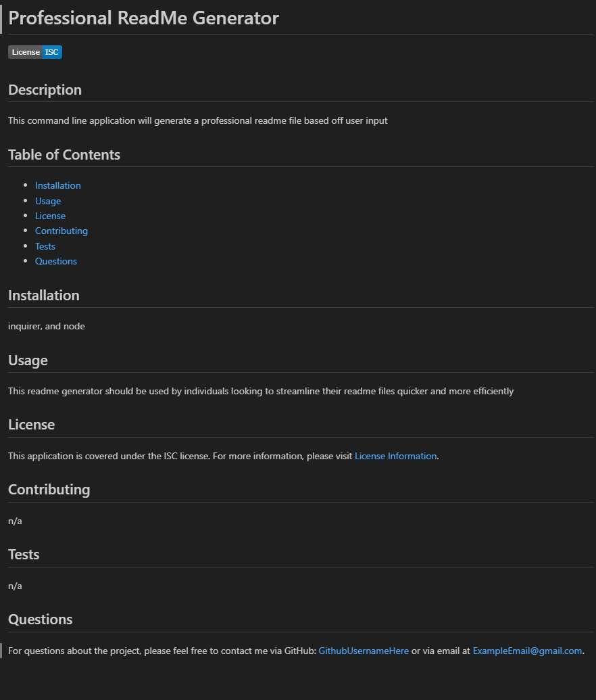

# Professional-README-Generator

Motivation
- As a developer, I understand the importance of having a well-documented project. However, creating a professional README file from scratch can be time-consuming and tedious.

Purpose
- The purpose of this README generator is to streamline the process of creating README files for new projects. By providing a command-line interface that accepts user input, developers can quickly generate high-quality README.md files with essential sections such as Description, Table of Contents, Installation, Usage, License, Contributing, Tests, and Questions.

Problems
- Prior to using this README generator, developers often faced challenges in creating consistent and comprehensive README files. Manually crafting each section required significant time and effort, leading to inconsistencies across projects.

Learnings
- Developers using this README generator will gain valuable insights into the structure and content of a professional README file. By guiding users through prompts for project information, this tool facilitates understanding of the key components necessary for effective project documentation. Additionally, developers will learn about different software licenses and how to include them in their projects, as well as best practices for providing contact information and linking to their GitHub profile. Through the use of this tool, developers will enhance their project management skills and contribute to the overall professionalism of their work.

## Screenshot

## Links
[Video URL](https://drive.google.com/file/d/15mMm_1YZiwE7tQ5qely3qiduIgxvJhlA/view?usp=sharing)

